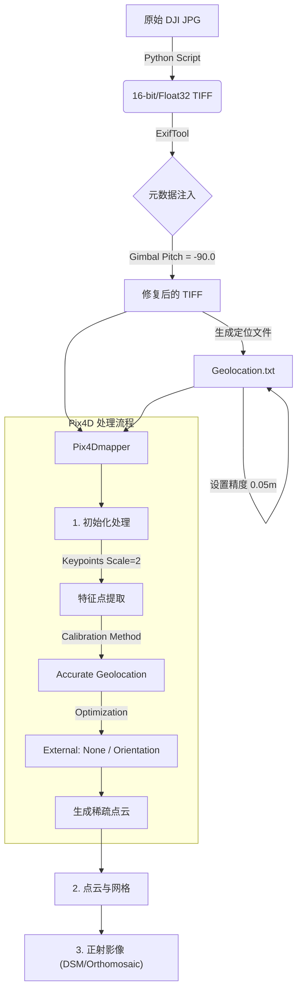

# DJI M3T 热成像 Pix4D 处理工作流总结

## 1. 项目背景
- **设备**: DJI Mavic 3 Thermal (M3T)
- **数据**: 640x512 热成像 JPG (R-JPEG)
- **挑战**: 
  - 原始JPG的Exif信息在Pix4D中识别不全。
  - 热成像纹理少，对比度低，匹配困难。
  - 存在严重的"Too many oblique cameras"（倾斜相机过多）错误，导致无法建图。

## 2. 核心工作流 (Workflow)

## 3. 关键技术点

### 3.1 数据转换 (Python)
使用脚本 `main_20260115.py` 进行预处理：
1. **解码**: 调用 `dji_irp.exe` 将 R-JPEG 解码为 Float32 温度数据的 Raw 格式。
2. **格式**: 转换为 TIFF 格式，保留原始温度数值。
3. **元数据修复 (Crucial)**:
   - 使用 `exiftool` 强制复制 GPS、Make、Model 和 XMP 信息。
   - **核弹级修复**: 强制写入 `-XMP-drone-dji:GimbalPitchDegree=-90.0`。
   - *原因*: Pix4D 会根据云台角度判断是正射还是倾斜。如果识别为倾斜（0度），会尝试用倾斜模型校准，导致 100% 失败。强制设为 -90（垂直向下）可欺骗软件使用正射模型。

### 3.2 欺骗式高精度定位
为了让 Pix4D 接受 "External Optimization: None"（不优化外方位元素），必须让它认为 GPS 非常准。
1. **生成文件**: `geolocation_high_precision_full.txt`
2. **修改精度**: 将水平/垂直精度强制设为 `0.05` / `0.10` 米。
3. **效果**: 启用 "Accurate Geolocation and Orientation" 校准模式。

### 3.3 Pix4D 参数设置 (Golden Recipe)

| 参数项 | 设置值 | 原因 |
| :--- | :--- | :--- |
| **模板** | Thermal Camera | 基础设置 |
| **关键点图像比例** | **Custom (2)** | **最关键**: 将 640x512 放大一倍处理，增加特征点数量，解决 "Low matches" 问题。 |
| **校准方法** | Accurate Geolocation and Orientation | 配合高精度 txt 文件使用，强制信任 GPS 位置。 |
| **内部参数优化** | All | 允许软件微调镜头畸变。 |
| **外部参数优化** | **None (无)** | **核心技巧**: 强制锁定 GPS 位置和角度，防止因热成像纹理不清导致的相机乱飞。 |
| **匹配策略** | Custom (相邻=10, 相似=10) | 增加搜索范围，提高连接率。 |

## 4. 视觉质量优化 (Visual Optimization)

### 问题：图像倾斜/歪斜 (Tilt/Skew)
**原因**: 在初始化步骤中，我们选择了 "External Optimization: None"。这意味着 Pix4D 完全信任无人机的原始 GPS/IMU 数据。如果无人机的罗盘或 IMU 存在细微的系统性偏差（例如整体向左倾斜 2 度），生成的地图也会保留这个倾斜，导致正射影像看起来像是个斜面。

### 解决方案
在第一步初始化成功（生成了稀疏点云，且相机连接正常）之后，进行**重新优化 (Re-optimize)**：

1. **保持点云不删**: 不要重新运行完整的步骤 1，只需修改设置。
2. **修改设置**:
   - 点击菜单 `Process` -> `Processing Options`。
   - 进入 `1. Initial Processing` -> `Calibration`。
   - 将 `Camera Optimization` -> `External Parameters` 从 **"None"** 改为 **"Orientation" (方向)**。
   - *注意*: 保持 Position (位置) 锁定（即不要选 All，只选 Orientation）。
3. **执行优化**:
   - 点击菜单 `Process` -> `Re-optimize` (不要点 Start)。
   - 等待几分钟，软件会重新计算相机的角度，但保持 GPS 位置不变。

**原理**: 允许软件根据图像内容自动修正 IMU 的角度误差（去倾斜），但仍然由 GPS 强力固定位置，防止“香蕉效应”或弯曲。

## 5. 常见错误对照

- **Error e0046: No calibrated cameras**: 特征点不足。-> 改 Keypoints Scale = 2。
- **Too many oblique cameras**: 云台角度错误。-> 脚本强制写入 GimbalPitch = -90。
- **Error: External Optimization None requires Accurate Geolocation**: 精度设置冲突。-> 导入 0.05m 精度的 txt 文件。
